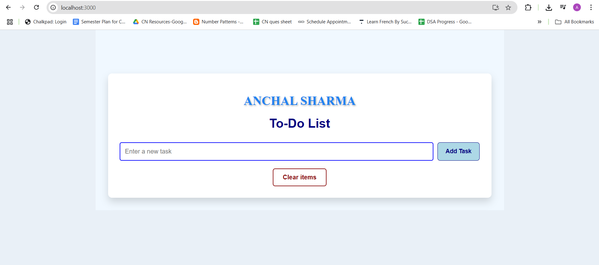
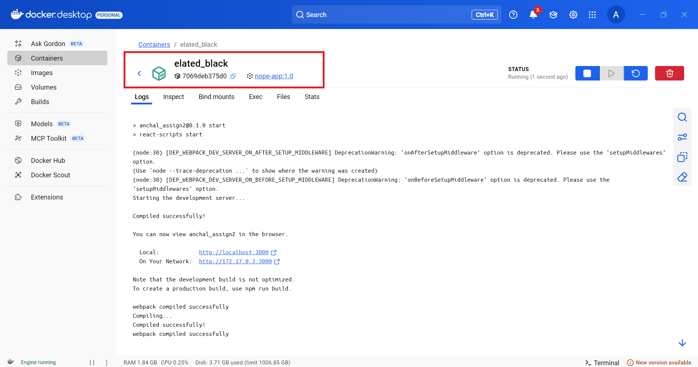

# 🚀 React + Docker App

A simple React application containerized using Docker.

---

## 📚 Project Description

This React app is bundled and served using node through a Docker container. The goal was to learn how to containerize a frontend application and make it production-ready using Docker best practices.

---

## 📸 Screenshot



## Docker Desktop



---

## 🏗️ Technologies Used

- ⚛️ React
- 🐳 Docker
- 📦 Node.js & npm

---

## 📂 Project Structure

```
anchal_assign2/
├── Dockerfile
├── .dockerignore
├── .gitignore
├── package.json
├── public/
├── src/
└── README.md
```

---

## 🐳 How to Run with Docker

### 1. Clone the Repo

```bash
git clone https://github.com/Anchalsharma432/react-docker-app.git
cd react-docker-app
```

### 2. Build Docker Image

```bash
docker build -t nope-app .
```

### 3. Run Docker Container

```bash
docker run -d -p 3000:3000 nope-app:1.0
```

✅ Open your browser at: **http://localhost:3000**

---

## 📄 Dockerfile Overview

```Dockerfile
# Step 1: Serve the React app
FROM node:19-alpine

WORKDIR /app
COPY package*.json ./
RUN npm install
COPY . .
EXPOSE 3000
CMD ["npm", "start"]

---

## 🧾 .gitignore

```gitignore
node_modules
build
.dockerignore
Dockerfile
npm-debug.log
.env
```

---

## 🙋‍♀️ Author

**Anchal Sharma**  
📧 sharmavatts432@gmail.com  
🔗 [GitHub Profile](https://github.com/anchalsharma432)

---

## 🪪 License

This project is licensed under the [MIT License](LICENSE).

---
